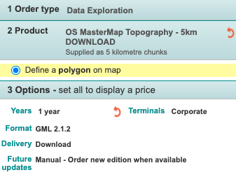

# Creating a Colouring London database from scratch

## Data downloading

The scripts in this directory are used to extract, transform and load (ETL) the core datasets
for Colouring London:

1. Building geometries, sourced from Ordnance Survey (OS) MasterMap (Topography Layer)
1. Unique Property Reference Numbers (UPRNs), sourced from Ordnance Survey AddressBase

To get the required datasets, you'll need to complete the following steps:

1. Sign up for the Ordnance Survey [Data Exploration License](https://www.ordnancesurvey.co.uk/business-government/licensing-agreements/data-exploration-sign-up). You should receive an e-mail with a link to log in to the platform (this could take  up to a week).
2. Navigate to https://orders.ordnancesurvey.co.uk/orders and click the button for: ✏️ Order. From here you should be able to click another button to add a product.
3. Drop a rectangle or Polygon over London and make the following selections, clicking the "Add to basket" button for each:


<p></p>


4. You should be then able to check out your basket and download the files

## Prerequisites

You should already have set up PostgreSQL and created a database. Make sure to create environment variables to use `psql` if you haven't already:

```bash
export PGPASSWORD=<pgpassword>
export PGUSER=<username>
export PGHOST=localhost
export PGDATABASE=<colouringlondondb>
```

Create the core database tables:

```bash
cd ~/colouring-london
psql < migrations/001.core.up.sql
```

There is some performance benefit to creating indexes after bulk loading data.
Otherwise, it's fine to run all the migrations at this point and skip the index
creation steps below.

Install GNU parallel, this is used to speed up loading bulk data.

## Make data available to Ubuntu

If you didn't download the OS files to the Ubuntu machine where you are setting up your Colouring London application, you will need to make them available there. If you are using Virtualbox, you could host share a the two folders containing the files (one for MasterMap, one for AddressBase) with the VM via a shared folder (e.g. [see these instructions for Mac](https://medium.com/macoclock/share-folder-between-macos-and-ubuntu-4ce84fb5c1ad)).

## Process and load Ordnance Survey data

The scripts should be run in the following order:

```bash
cd ~/colouring-london/etl
# extract both datasets
sudo ./extract_addressbase.sh ./addressbase_dir
sudo ./extract_mastermap.sh ./mastermap_dir
# filter mastermap ('building' polygons and any others referenced by addressbase)
sudo ./filter_transform_mastermap_for_loading.sh ./addressbase_dir ./mastermap_dir
# load all building outlines
sudo ./load_geometries.sh ./mastermap_dir
# index geometries (should be faster after loading)
psql < ../migrations/002.index-geometries.sql
# create a building record per outline
sudo ./create_building_records.sh
# add UPRNs where they match
load_uprns.py ./addressbase_dir
# index building records
psql < ../migrations/003.index-buildings.sql
```

## Finally

Run the remaining migrations in `../migrations` to create the rest of the database structure.

# Updating the Colouring London database with new OS data